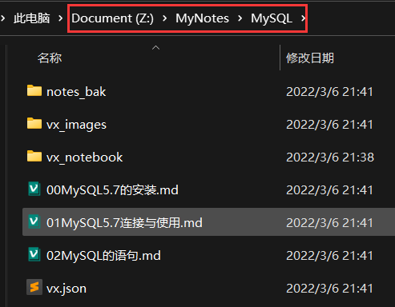
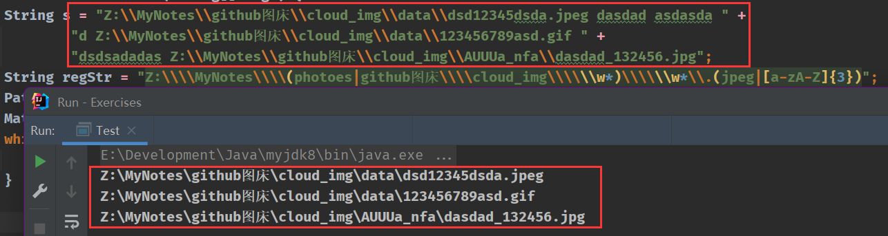
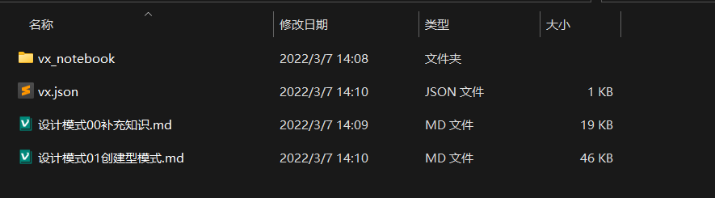
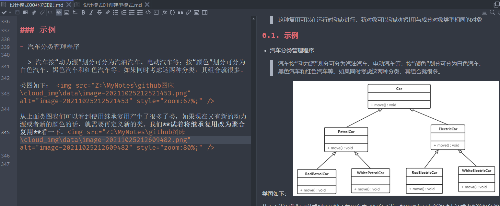
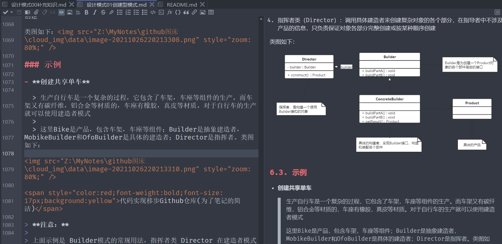
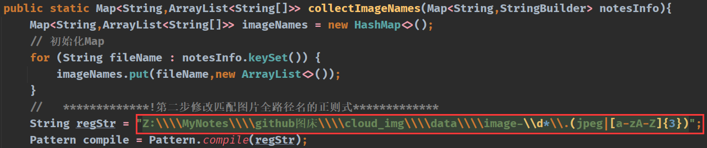
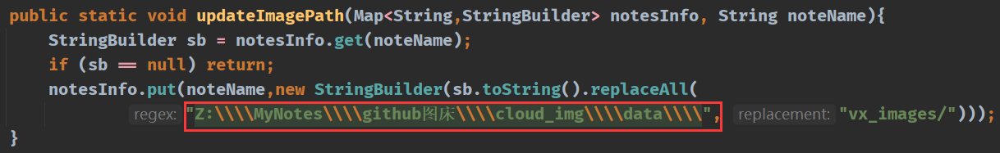
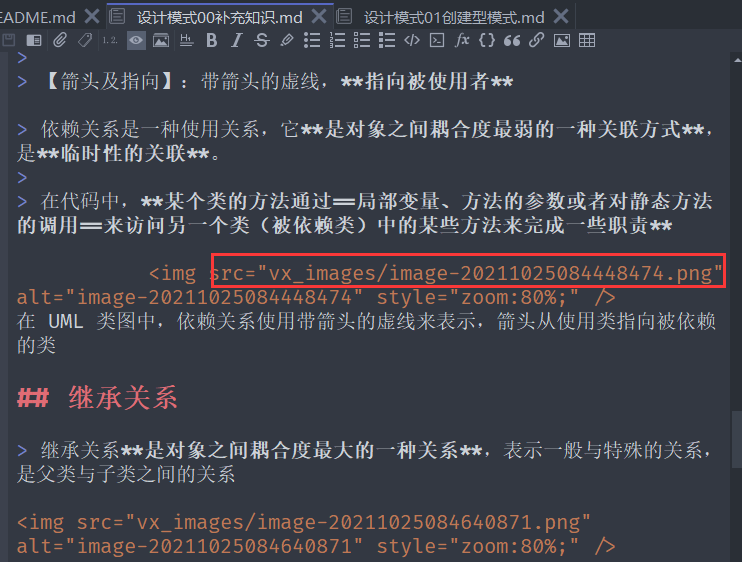
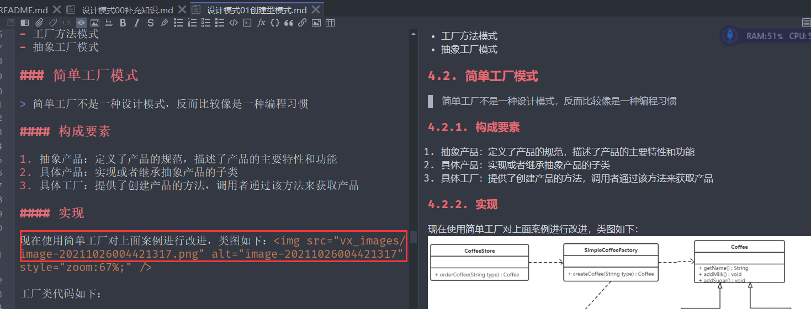
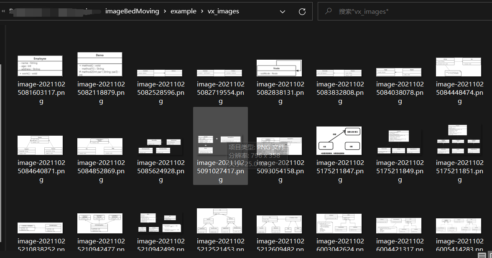

# ImageBedMoving

A java Program~(所以你需要将jre配置到本地环境变量中...才能继续使用)

### 使用之前：**要求使用者对java正则表达式有基础的了解**。

1. 找到main函数，将`notesDir`改为自己笔记所在目录


```java
public static void main(String[] args) {
        //    *************!第一步修改笔记所在目录*************
        String notesDir = "Z:\\MyNotes\\Java\\JVM";  // 笔记所在目录
        String imageBedPath = notesDir + "\\vx_images";  // 笔记同目录建立图床
        String notesBackupPath = notesDir + "\\notes_bak";

```

2. 找到collectImageNames函数，将两处`regStr`改为自己所需的正则表达式(只要能够匹配到笔记引用的图床路径即可)

```java
public static Map<String,ArrayList<String[]>> collectImageNames(Map<String,StringBuilder> notesInfo){
        
        //   *************!第二步修改匹配图片全路径名的正则式*************
        String regStr = "Z:\\\\MyNotes\\\\(photoes|github图床\\\\cloud_img\\\\\\w*)\\\\\\w*\\.(jpeg|[a-zA-Z]{3})";
        
        // 完全匹配失败,尝试切换路径符
        if (imageNum == 0){
            // *************此为上者的补充，兼容到/  *************
            regStr = "Z:/MyNotes/(photoes|github图床/cloud_img/\\w*)/\\w*\\.(jpeg|[a-zA-Z]{3})";
            
        }
      
    }
```

> 文中例子：
> `Z:\\\\MyNotes\\\\(photoes|github图床\\\\cloud_img\\\\\\w*)\\\\\\w*\\.(jpeg|[a-zA-Z]{3})`
> 
> 匹配路径：`Z:\MyNotes\(photoes|github图床\cloud_img\某个文件夹)\图片名.(jpeg|[a-zA-Z]{3})`一系列后缀




3. 找到updateImagePath函数，将`Z:/MyNotes/(photoes|github图床/cloud_img/\\w*)/`替换成自己笔记中的路径

```java
public static void updateImagePath(Map<String,StringBuilder> notesInfo, String noteName){
        StringBuilder sb = notesInfo.get(noteName);
        if (sb == null) return;
        notesInfo.put(noteName,new StringBuilder(sb.toString().replaceAll(
                "Z:/MyNotes/(photoes|github图床/cloud_img/\\w*)/", "vx_images/")));
    }
```

> 比如：
> 原图床为`D:\abc\图床\a分区\`
> 则你应将`Z:/MyNotes/(photoes|github图床/cloud_img/\\w*)/`更改为`D:\abc\图床\a分区\`
> 
> 效果为：`D:\abc\图床\a分区\图片.png`将被更改为`vx_images/图片.png`

由此，所有工作都完毕。

注意：本程序只将本目录下的笔记文件进行操作，不会考虑到子目录的情况，如需对子目录的文件进行操作，则应该将main函数的`notesDir`进行更新。

注意：本程序不会无端的改动原笔记，所以在文件操作之前，进行了备份。所有的备份笔记在同目录`notes_bak`下。


成果展示：

笔记目录(**直接从原目录建立笔记本**)改动前：


笔记1改动前：


笔记2改动前：



转到IDE，进行上述教程第一步修改


第二步，因为我还是原来的图床，本来就是匹配的，所以不需要更改


第三步，同理


运行。。。。。。


成果：






