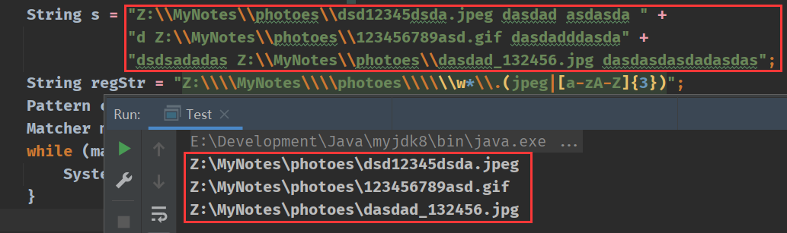

# ImageBedMoving

A java Program~(所以你需要将jdk配置到本地环境变量中...才能继续使用)

### 使用之前：**要求使用者对java正则表达式有基础的了解**。

# 教程

下载`FileOperation_Bak.java`到本地，用记事本或者sublime编辑

1. 找到`main`函数，将`notesDir`改为自己笔记所在目录

```java
public static void main(String[] args) {
           /**************!第一步修改笔记所在目录*************/
        String notesDir = "Z:\\MyNotes\\Java\\JVM";  // 笔记所在目录
                  // 下面这几个都不需要更改 
        String imageBedPath = notesDir + "\\vx_images";  // 笔记同目录建立图床
        String notesBackupPath = notesDir + "\\notes_bak";

```

2. 找到`collectImageNames`函数，将`regStr`改为自己所需的正则表达式(只要能够匹配到笔记引用的图床路径即可)

```java
public static Map<String,ArrayList<String[]>> collectImageNames(Map<String,StringBuilder> notesInfo){
        
           /*************!第二步修改匹配图片全路径名的正则式*************/
           
        /*  Java正则中普通的\ 为 \\\\
            Z:\\\\MyNotes\\\\photoes\\\\\\w*\\.(jpeg|[a-zA-Z]{3}) 表示匹配 Z:\Mynotes\photoes\xxxx.jpeg或者png或者gif
            Z:/MyNotes/photoes/\\w*\\.(jpeg|[a-zA-Z]{3}) 表示匹配 Z:/Mynotes/photoes/xxxx.jpeg或者png或者gif
        */
        String regStr = "Z:\\\\MyNotes\\\\photoes\\\\\\w*\\.(jpeg|[a-zA-Z]{3})";
      
}
```

## 匹配案例



3. 找到`updateImagePath`函数，将`Z:\\\\MyNotes\\\\photoes\\\\`替换成自己笔记中的路径

```java
public static void updateImagePath(Map<String,StringBuilder> notesInfo, String noteName){
        StringBuilder sb = notesInfo.get(noteName);
        if (sb == null) return;
        /* 第二处若为 Z:\\\\MyNotes\\\\photoes\\\\\\w*\\.(jpeg|[a-zA-Z]{3})
           则此处应为 Z:\\\\MyNotes\\\\photoes\\\\
           第二处若为 Z:/MyNotes/photoes/\\w*\\.(jpeg|[a-zA-Z]{3})
           则此处应为 Z:/MyNotes/photoes/
        */
        notesInfo.put(noteName,new StringBuilder(sb.toString().replaceAll(
                "Z:\\\\MyNotes\\\\photoes\\\\", "vx_images/")));
}
```

> 比如：
> 原图床为`D:\abc\图床\a分区\`
> 则你应将`Z:\\\\MyNotes\\\\photoes\\\\`更改为`D:\\\\abc\\\\图床\\\\\a分区\\\\`
> 
> 效果为：`D:\abc\图床\a分区\图片.png`将被更改为`vx_images/图片.png`

由此，所有工作都完毕。

#### 注意：本程序是迁移图片，而不是复制，所有迁移的图片最终都将在笔记目录中的`vx_images`中

#### 注意：本程序不会无端的改动原笔记，所以在文件操作之前，强制进行了备份。所有备份笔记在同目录`notes_bak`下

#### 注意：本程序只对本目录下的笔记文件进行操作，不会考虑到子目录的情况，如需对子目录的文件进行操作，则应该将main函数的`notesDir`进行更新


# 成果展示

笔记目录(**直接从原目录建立笔记本**)改动前：


笔记1改动前：


笔记2改动前：


## 编辑`FileOperation_Bak.java`


```bash
javac FileOperation_Bak.java
java FileOperation_Bak.class
```

不会的小伙伴可以百度一下java文件怎么编译~其实非常的简单。。。就上面两个指令，在`FileOperation_Bak.java`目录中打开cmd输入即可

## 运行结果


## 最后成效

笔记1更改成功


笔记2更改成功


笔记目录下多出了notes_bak目录，存放的是改动前的笔记，且vx_images目录已被自动创建


进入vx_images，可以看到所有被迁移的图片
