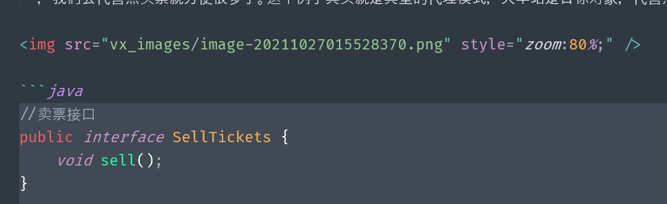

# ImageBedMoving

# ImageBedMoving做了什么？

1. ImageBedMoving会先读取`ImageMoving.properties`内的配置信息
2. 遍历`NotesDir`文件树下的`所有md内容`，将符合配置要求的图片移动到`同级目录`下的`vx_images`
3. 进行笔记备份，存储到`同级notes_bak目录`
4. 更新笔记中的图片路径[xxxx/图片.jpg ----> vx_images/图片.jpg]

**日志存储在:`${NotesDir}/00log.txt`**

# 使用教程

1. 将本仓库clone到本地
2. 解压`jre.zip`(Java运行环境),保持如下的路径`imageBedMoving/jre/jre`


## 1 ImageMoving

1. 用记事本编辑`ImageMoving.properties`

```bash
# 笔记所在目录(需要用户自定义)  采用/路径符
NotesDir=E:/git_exercise/imageBedMoving/example

# 例如:你有一张图片
# ImagesBedPathReg=Z:/MyNotes/github图床/cloud_img/data/ 可以匹配 Z:/MyNotes/github图床/cloud_img/data/
# ImageNameReg=.*?\\.(jpeg|[a-zA-Z]{3}) 可以匹配 图片.jpg

# 原图床路径(支持Java正则)  无论笔记中如何,此处统一采用/路径符
ImagesBedPathReg=Z:/MyNotes/github图床/cloud_img/data

# ------------------非必选----------------
# 匹配图片名的正则式(下式几乎可匹配所有图片名)
# 如有需求,自行编写; 填写前,请运行RegStringTest测试是否有效
ImageNameReg=.*?\\.(jpeg|[a-zA-Z]{3})
# 笔记文件名后缀 md
NotesType=md
# 是否保留原来的图片  no |  yes(建议)
KeepOriginImages=yes
```

2. 双击`ImageMoving_Run.bat`

对于多线程,将完全遍历笔记根目录下的所有内容,并在相应目录创建各自的`notes_bak`和`vx_images`

对于单线程,只对当前目录进行处理,不会遍历子目录

## 2 RegStringTest(如果你希望检测你的正则表达式)

> 这是一个正则表达式测试工具，用来辅助用户编辑`ImageMoving.properties`。你可以先使用RegStringTest测试你自己的正则表达式，看一下是否符合预期的效果。确认无误后再将其写入`ImageMoving.properties`

1. 用记事本编辑`RegStringTest.properties`
2. 双击`RegStringTest_Run.bat`
3. 光标会先停顿,你可以将记事本中准备好的案例复制到终端
4. 回车后，输入exit再次回车
5. 程序会自动进行匹配，通过打印结果，可以检测你的正则表达式是否有效

# 成果展示

运行前(run before):


运行后(run after):




